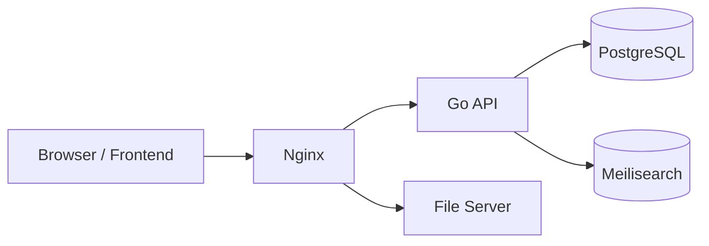

# JWT + PostgreSQL による認証・ユーザ管理の最終実装案

## 1. 目的
現在の Basic 認証を廃止し、JWT を用いた認証基盤へ移行する。あわせて、ユーザ情報を PostgreSQL で管理し、認証・認可・ユーザ運用をアプリケーション側で完結できる構成にする。加えて、開発・運用を通して全コンポーネントを Docker / Docker Compose で管理する。

## 2. 現状からの変更点
### 2.1 廃止するもの
- Nginx の Basic 認証
- `.htpasswd` によるユーザ管理
- 認証情報の設定ファイル依存

### 2.2 追加するもの
- Go による認証サーバーまたは認証モジュール
- PostgreSQL によるユーザ保存
- JWT アクセストークン発行
- リフレッシュトークン管理
- ロールベースの権限制御
- パスワードリセットとユーザ無効化

## 3. 最終構成
### 3.1 コンポーネント
- Nginx コンテナ
- Go API コンテナ
- PostgreSQL コンテナ
- Meilisearch コンテナ
- ファイルサーバーコンテナ
- フロントエンドコンテナ

### 3.2 役割分担
- Nginx: TLS 終端、リバースプロキシ、静的配信
- Go API: 認証、認可、ユーザ管理、検索 API、JWT 検証
- PostgreSQL: ユーザ、ロール、リフレッシュトークン、監査情報の永続化
- Meilisearch: 検索インデックス
- ファイルサーバー: PDF とサムネイル配信
- Docker Compose: 各コンテナの起動順、ネットワーク、永続化ボリューム、環境変数を統括

## 4. 最終アーキテクチャ


### 4.1 認証の流れ
1. ユーザがログイン画面で ID とパスワードを送信する。
2. Go API が PostgreSQL のユーザ情報を参照し、パスワードを検証する。
3. 認証成功時に JWT アクセストークンとリフレッシュトークンを発行する。
4. フロントエンドはアクセストークンを用いて API を呼び出す。
5. API は JWT を検証し、ユーザ ID とロールを利用して認可を行う。
6. アクセストークン失効時はリフレッシュトークンで再発行する。

## 5. Go 実装の責務
### 5.1 認証
- ログイン処理
- ログアウト処理
- トークン再発行
- パスワード検証
- パスワードハッシュ生成

### 5.2 認可
- JWT の署名検証
- クレームの検証
- ロール判定
- API ごとのアクセス制御

### 5.3 ユーザ管理
- ユーザ作成
- ユーザ更新
- ユーザ無効化
- ユーザ削除
- 一覧取得
- 詳細取得

### 5.4 セキュリティ
- パスワード平文保存禁止
- 強いハッシュアルゴリズムの使用
- トークンの有効期限管理
- 失敗回数制限
- 監査ログ出力

## 6. 技術スタック
### 6.1 Go 側
- Go 1.22 以上
- HTTP フレームワークは標準 net/http または軽量ルーター
- JWT ライブラリ
- PostgreSQL ドライバ
- migration ツール
- パスワードハッシュライブラリ

### 6.2 DB 側
- PostgreSQL 16 系を推奨
- PostgreSQL は Docker コンテナとして起動する
- マイグレーションでスキーマ管理
- インデックス設計を前提に検索を高速化

## 7. データベース設計
### 7.1 users テーブル
| カラム        | 型          | 必須 | 説明               |
| ------------- | ----------- | ---- | ------------------ |
| id            | UUID        | 必須 | 主キー             |
| login_id      | text        | 必須 | ログイン ID、一意  |
| display_name  | text        | 必須 | 表示名             |
| email         | text        | 任意 | メールアドレス     |
| password_hash | text        | 必須 | パスワードハッシュ |
| role          | text        | 必須 | admin, user など   |
| is_active     | boolean     | 必須 | 有効状態           |
| last_login_at | timestamptz | 任意 | 最終ログイン日時   |
| created_at    | timestamptz | 必須 | 作成日時           |
| updated_at    | timestamptz | 必須 | 更新日時           |
| deleted_at    | timestamptz | 任意 | 論理削除日時       |

### 7.2 refresh_tokens テーブル
| カラム     | 型          | 必須 | 説明                           |
| ---------- | ----------- | ---- | ------------------------------ |
| id         | UUID        | 必須 | 主キー                         |
| user_id    | UUID        | 必須 | users 参照                     |
| token_hash | text        | 必須 | リフレッシュトークンのハッシュ |
| expires_at | timestamptz | 必須 | 有効期限                       |
| revoked_at | timestamptz | 任意 | 無効化日時                     |
| created_at | timestamptz | 必須 | 作成日時                       |
| updated_at | timestamptz | 必須 | 更新日時                       |

### 7.3 audit_logs テーブル
| カラム        | 型          | 必須 | 説明                                 |
| ------------- | ----------- | ---- | ------------------------------------ |
| id            | UUID        | 必須 | 主キー                               |
| actor_user_id | UUID        | 任意 | 操作実行者                           |
| action        | text        | 必須 | login, create_user, update_user など |
| target_type   | text        | 任意 | users など                           |
| target_id     | UUID        | 任意 | 対象 ID                              |
| detail        | jsonb       | 任意 | 補足情報                             |
| created_at    | timestamptz | 必須 | 実行日時                             |

### 7.4 制約
- `login_id` に一意制約を付与する
- `email` を使うなら一意制約の有無を要件で確定する
- `role` は列挙値に制限する
- `password_hash` は平文保存しない
- リフレッシュトークンはハッシュで保存する

## 8. JWT 設計
### 8.1 トークン種別
- アクセストークン: 短命
- リフレッシュトークン: 長命

### 8.2 アクセストークンのクレーム例
- sub: ユーザ ID
- login_id: ログイン ID
- role: 権限
- exp: 有効期限
- iat: 発行時刻
- iss: 発行者
- aud: 利用先

### 8.3 有効期限の方針
- アクセストークンは 15 分から 60 分程度
- リフレッシュトークンは 7 日から 30 日程度
- 管理者操作はより短い再認証要件を追加可能

### 8.4 署名方式
- HMAC 方式または RSA 方式を選択する
- 単純構成では HMAC、運用分離を重視するなら RSA を採用する
- 秘密鍵は環境変数またはシークレット管理に置く

## 9. 認証フロー
### 9.1 ログイン
1. フロントエンドが login_id と password を送信
2. Go API が users テーブルから対象ユーザを取得
3. is_active と deleted_at を確認
4. password_hash を検証
5. 成功時にアクセストークンとリフレッシュトークンを返却
6. last_login_at を更新

### 9.2 認証済み API 呼び出し
1. フロントエンドは Authorization ヘッダに Bearer トークンを付与
2. Go API が JWT を検証
3. sub と role をコンテキストに設定
4. 権限に応じて処理を実行

### 9.3 トークン更新
1. アクセストークン失効時にリフレッシュトークンを送信
2. DB 上の保存値と照合
3. 有効なら新しいアクセストークンを発行
4. 必要に応じてリフレッシュトークンもローテーション

### 9.4 ログアウト
1. クライアントから logout 要求を送信
2. リフレッシュトークンを revoke
3. クライアント側保存トークンを破棄

## 10. 権限制御
### 10.1 ロール
- admin: ユーザ管理、設定変更、全データ参照
- user: 一般利用、限定された参照のみ

### 10.2 制御方針
- 認証は全 API で共通ミドルウェア化する
- 管理系 API は admin のみ許可する
- 重要操作は二重確認または再認証を検討する

## 11. API 設計案
### 11.1 認証系
- POST /auth/login
- POST /auth/refresh
- POST /auth/logout
- GET /auth/me

### 11.2 ユーザ管理系
- GET /users
- POST /users
- GET /users/:id
- PATCH /users/:id
- DELETE /users/:id
- POST /users/:id/reset-password
- POST /users/:id/disable
- POST /users/:id/enable

### 11.3 検索系
- GET /search
- POST /search
- GET /indexes

### 11.4 ヘルスチェック
- GET /health

## 12. Nginx の最終方針
### 12.1 廃止する設定
- `auth_basic`
- `auth_basic_user_file`
- `.htpasswd` のマウント

### 12.2 Nginx の役割
- TLS 終端
- Host ベースのルーティング
- Go API へのリバースプロキシ
- ファイル配信の中継

### 12.3 期待する状態
- 認証は Nginx ではなく Go API で実施
- Nginx は認証ロジックを持たない
- ヘルスチェックは必要なら内部用途のみで公開する

## 13. デプロイ構成案
### 13.1 Compose サービス
- api: Go API
- postgres: PostgreSQL
- meilisearch: Meilisearch
- file_server: Nginx
- frontend: フロントエンド
- uploader: 必要なら別ジョブまたはバッチ

### 13.2 Docker 管理方針
- 全サービスは Dockerfile でイメージ化し、Docker Compose で統合起動する
- 永続データは named volume または bind mount で管理する
- 接続先は localhost ではなくコンテナ名を基準にする
- 設定値は環境変数と .env ファイルで分離する
- 本番と開発で compose ファイルを分ける場合は共通定義を重ねる

### 13.3 環境変数
- DATABASE_URL
- JWT_SECRET または JWT_PRIVATE_KEY
- JWT_PUBLIC_KEY
- ACCESS_TOKEN_TTL
- REFRESH_TOKEN_TTL
- MEILISEARCH_HOST
- MEILISEARCH_PSW
- PORT

## 14. ディレクトリ構成案
```text
api/
  src/
    auth/
    users/
    middleware/
    repositories/
    services/
    index.ts
  migrations/
  package.json
  tsconfig.json

go-auth/
  cmd/
  internal/
    auth/
    users/
    middleware/
    repository/
    service/
  migrations/
  go.mod
  go.sum

compose.yml
.env

nginx/
  nginx.conf
  Dockerfile

postgres/
  Dockerfile
  init/
  migrations/

meilisearch/
  Dockerfile

uploader/
  main.py

frontend/
  Dockerfile
  src/
```

## 15. セキュリティ要件
- パスワードは bcrypt もしくは argon2 でハッシュ化する
- JWT 署名鍵はコードに直書きしない
- リフレッシュトークンは DB に平文保存しない
- ログイン失敗回数を制限する
- 管理 API は権限チェックを必須化する
- 重要操作は監査ログに残す

## 16. 運用要件
- 初期管理者を seed で作成できること
- パスワード再設定手順を用意すること
- 無効化ユーザの既存トークン失効方針を明確にすること
- DB バックアップと復元手順を定義すること
- 秘密鍵ローテーション手順を定義すること
- Docker イメージの再ビルドと再デプロイ手順を定義すること
- ボリュームバックアップとリストア手順を定義すること

## 17. 移行方針
### 17.1 移行の順序
1. PostgreSQL の導入
2. users と refresh_tokens の実装
3. Go 側の認証 API 実装
4. フロントエンドのログイン対応
5. Nginx Basic 認証の削除
6. 既存運用データの移行
7. Compose による全体起動へ切り替え

### 17.2 互換期間
- 必要であれば短期間だけ Basic 認証と JWT を並行運用する
- ただし最終形では Basic 認証を完全に廃止する

## 18. 受け入れ条件
- ユーザ情報が PostgreSQL で管理されている
- JWT によるログインと認証が動作する
- ロールに応じたアクセス制御が動作する
- 無効化ユーザは利用不可である
- Nginx の Basic 認証が不要になっている
- パスワードとトークンが安全に保存されている
- 全コンポーネントが Docker Compose で起動・停止・再構築できる
- PostgreSQL がコンテナとして永続化されている

## 19. 最終到達点
最終的にこのシステムは、Nginx を単なるプロキシ層として残しつつ、認証の中核を Go API に移す構成になる。ユーザ管理は PostgreSQL に集約され、ログイン状態は JWT とリフレッシュトークンで扱う。これにより、設定ファイルベースの認証運用から、拡張可能なアプリケーション中心の認証基盤へ移行できる。
